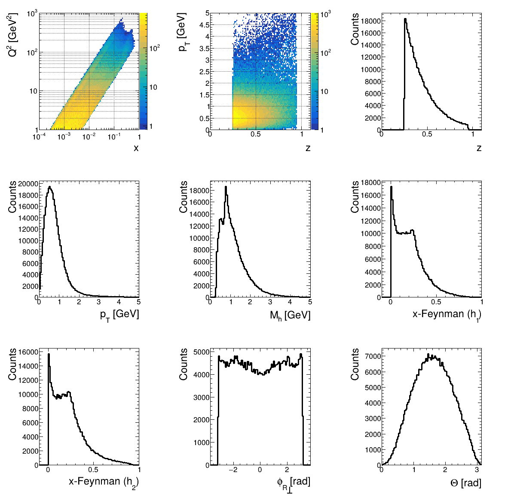

# eic-legacy-greg
Legacy code for existing EIC projects (hopefully) organized enough for reproducibility.

## Submodules
This repository includes the following submodules:

- [tmd-eic-ana](https://github.com/Gregtom3/tmd-eic-ana): Analysis tools for TMD studies in EIC.
- [epic-analysis](https://github.com/eic/epic-analysis/tree/dihadron): Analysis tools for dihadron studies in EIC. This project loads the `dihadron` branch which has some unmerged features.

### Cloning the Repository
To clone this repository along with its submodules, use the following command:

```bash
git clone --recurse-submodules https://github.com/Gregtom3/eic-legacy-greg.git
```

If you have already cloned the repository and want to initialize the submodules, run:

```bash
git submodule update --init --recursive
```

To update all submodules to their latest remote changes, run:

```bash
make update
```

### Building the Project
This repository includes a `Makefile` to simplify the setup and build process. If you do not already have it setup, you can install the latest version of `eic-shell` with:

```bash
make eic-shell
```

You can then enter into the `eic-shell` with the following command:

```bash
./eic-shell/eic-shell
```

To set up the environment and build all submodules, you must first be inside the `eic-shell`. The `epic-analysis` submodule requires `delphes`. A first time installation can be run:

```bash
make delphes
```

Then, to install the remaining submodules, run:

```bash
make all
```

**Note:** If the `eic-shell` script cannot be downloaded automatically, you can manually download it from the [eic-shell repository](https://github.com/eic/eic-shell) and place it in the `eic-shell` directory.

To clean up the `eic-shell` directory, you can run:

```bash
make clean-eic-shell
```

To clean up the submodules, you can run:

```bash
make clean
```

### Setting Up a Virtual Environment

To set up a Python virtual environment for this project, follow these steps:

1. **Create the Virtual Environment**:
   ```bash
   python3 -m venv .venv
   ```

2. **Activate the Virtual Environment**:
   ```bash
   source .venv/bin/activate
   ```

3. **Install Dependencies**:
   ```bash
   pip install -r requirements.txt
   ```

4. **Deactivate the Virtual Environment** (when done):
   ```bash
   deactivate
   ```


## Usage

Two separate groups are interested in projecting $A_{UT}$ for the EIC. The repository is organized in reference to the points-of-contact for these two analyses:

- Yorgo: Studying $A_{UT}$ from $\pi^+\pi^-$ dihadrons using e+p and e+He3 scattering events. Results are meant to be projected based on the Early Science program of the EIC.
- Filippo: Studying $A_{UT}$ from $\pi^+$ dihadrons using e+p scattering events. Results are meant to be projected based on the Full EIC timeline.

For now, let "PROJECT_TYPE=yorgo,filippo" as this will be used to reference how scripts are to be run in the repository.


### Creating Datasets

The general workflow is shown in the Figure above. First, the `epic-analysis` repository is called to generate TTrees of either single hadron SIDIS or Dihadron SIDIS events:

```bash
./analysis/PROJECT_TYPE/create_dataset.rb
```

Runcards in `./analysis/PROJECT_TYPE/runcards/*.yaml` give details for how many events are simulated, how many root files are analyzed per slurm job, etc. For instance, `./analysis/filippo/runcards/ep_piplus.yaml` is organized as follows:

- **Project Name**: `PYTHIA8.ep_piplus`
- **Campaigns**: `epic.25.08.0`
- **Detectors**: `epic_craterlake`
- **Energies**: `5x41`, `10x100`, `18x275`
- **BEAGLE Simulation**: `false`
- **Number of Files**: `50000`
- **Number of ROOT Files per Job**: `40`
- **Path to Analysis Macro**: `macro/analysis_piplus.C`
- **Path to EIC Shell**: `../../eic-shell/`

For now, the **Path to Analysis Macro** and **Path to EIC Shell** are relative to the `epic-analysis` submodule.

The `create_dataset.rb` will run the analysis macro in parallel over a handful of computing nodes, scheduled via Slurm. The `.root` files created per node are merged into an `analysis.root` file which can be found in `out/`. A copy of the analysis macro is also saved to the subdirectory. For instance, for the above runcard, the output directories are at `out/PYTHIA8.ep_piplus___epic.25.08.0_5x41`, `out/PYTHIA8.ep_piplus___epic.25.08.0_10x100` and `out/PYTHIA8.ep_piplus___epic.25.08.0_18x275`.

### Kinematic Plots

A simple plotting code is provided for each project type (yorgo and filippo). You can run (preferably in the `eic-shell` and virtual environment):

```bash
python3 analysis/PROJECT_TYPE/kinematics_plotter.py
```

Plots default to being saved to `out/.../combo_plot.png`. An example is shown for $e+p$ 10x100 GeV $\pi^+\pi^-$ simulated with PYTHIA8.



### Injection Studies

Injection studies are initialized by configuration parameters set in `analysis/PROJECT_TYPE/run_injections.rb`. Parameters such as the table used (defines the binning scheme), the number of injections, how many injections occur per slurm job, etc. can all be tweaked. 

To submit injection jobs to Slurm, the following must be run outside the `eic-shell`.

```bash
./analysis/PROJECT_TYPE/run_injections.rb
```

Optionally the injection study can be run in terminal for testing purposes. If so, the same command must be run within the `eic-shell`. The ruby script will prompt the user to specify if they would like to run in terminal.

To adjust luminosities, check out `submodules/tmd-eic-ana/include/Constants.h` (measured in fb^-1):

```c
inline const std::map<LuminosityKey, double> IntegratedLuminosities = {
    {{"5x41",   eic_timeline_type::Full,        	target_type::Proton},   2.86},
    {{"10x100", eic_timeline_type::Full,        	target_type::Proton},   51.3},
    {{"18x275", eic_timeline_type::Full,        	target_type::Proton},   10.0},
    {{"10x100", eic_timeline_type::EarlyScience,	target_type::Proton},   10.0},
    {{"10x166", eic_timeline_type::EarlyScience,	target_type::Helium3},  8.65},
};
```

The injection study is carried out by the `tmd-eic-ana` submodule. The results are saved as `.yaml` files, one per Slurm job. These yaml's are saved in nested directories starting at `analysis/PROJECT_TYPE/injectout`. Here is an example `.yaml` output:

```
jobs:
  - bin_index: 3
    events: 4629
    expected_events: 156323161
    X_min: 0.000319
    X_max: 0.000473
    Q_min: 0
    Q_max: 1000
    Z_min: -99999
    Z_max: 99999
    PhPerp_min: -99999
    PhPerp_max: 99999
    used_reconstructed_kinematics: true
    n_injections: 1000
    injected: 3.450000000000109e-06
    all_extracted: [...]
    all_errors: [...]
    mean_extracted: -0.00039849860090485415
    stddev_extracted: 0.03327768326425713
    avg_X: 0.000390849729930922
    avg_Q: 1.5606600687491847
    avg_Q2: 2.583926829840962
    avg_Z: 0.16429418958255623
    avg_PhPerp: 0.5452089766031344
    avg_Y: 0.33571611922024897
    exp_lumi [nb^-1]: 10000000
    mc_lumi [nb^-1]: 861.5691614869147
```

After all Slurm jobs are completed, run the following script to collect information from all the `.yaml` files, saving them to a nice readable `.csv` (usually, it is this `.csv` which our collaborators need):

```bash
python3 analysis/PROJECT_TYPE/postprocess_injections.py
```

Here is an example of the `.csv` output:

| bin_index | events | expected_events | X_min   | X_max   | Q_min | Q_max | Z_min  | Z_max  | PhPerp_min | PhPerp_max | used_reconstructed_kinematics | n_injections | avg_X  | avg_Q | avg_Q2 | avg_Z | avg_PhPerp | avg_Y | exp_lumi [nb^-1] | mc_lumi [nb^-1] | injected_asymmetry | reconstructed_asymmetry | reconstructed_asymmetry_montecarlo_stderr | reconstructed_asymmetry_err |
|-----------|--------|-----------------|---------|---------|-------|-------|--------|--------|------------|------------|------------------------------|--------------|--------|-------|--------|-------|------------|-------|------------------|------------------|---------------------|--------------------------|------------------------------------------|-----------------------------|
| 0         | 3579   | 1.2e+08         | 4e-05   | 0.00013 | 0     | 1000  | -99999 | 99999  | -99999     | 99999      | True                         | 100          | 9.5e-05| 1.1   | 1.1    | 0.15  | 0.49       | 0.62  | 1.0e+07          | 861.57          | 0.0                 | -0.0074                 | 0.048                                  | 0.00081                   |
| 1         | 3929   | 1.4e+08         | 0.00013 | 0.00021 | 0     | 1000  | -99999 | 99999  | -99999     | 99999      | True                         | 100          | 0.00017| 1.2   | 1.5    | 0.16  | 0.52       | 0.46  | 1.0e+07          | 861.57          | 0.0                 | 7.8e-05                 | 0.039                                  | 0.00062                   |
| 2         | 4079   | 1.4e+08         | 0.00021 | 0.00032 | 0     | 1000  | -99999 | 99999  | -99999     | 99999      | True                         | 100          | 0.00026| 1.4   | 2.0    | 0.17  | 0.54       | 0.38  | 1.0e+07          | 861.57          | 4.9e-07             | -0.0061                 | 0.040                                  | 0.00063                   |
| 3         | 4629   | 1.6e+08         | 0.00032 | 0.00047 | 0     | 1000  | -99999 | 99999  | -99999     | 99999      | True                         | 100          | 0.00039| 1.6   | 2.6    | 0.16  | 0.55       | 0.34  | 1.0e+07          | 861.57          | 3.5e-06             | 0.00095                 | 0.033                                  | 0.00048                   |
| 4         | 5132   | 1.6e+08         | 0.00047 | 0.00069 | 0     | 1000  | -99999 | 99999  | -99999     | 99999      | True                         | 100          | 0.00058| 1.7   | 3.2    | 0.17  | 0.56       | 0.28  | 1.0e+07          | 861.57          | 8.3e-06             | -0.00039                | 0.034                                  | 0.00047                   |
| 5         | 7437   | 1.7e+08         | 0.00069 | 0.001   | 0     | 1000  | -99999 | 99999  | -99999     | 99999      | True                         | 100          | 0.00084| 1.9   | 4.0    | 0.17  | 0.55       | 0.24  | 1.0e+07          | 861.57          | 2.3e-05             | -0.0025                 | 0.028                                  | 0.00032                   |
| 6         | 3720   | 6.8e+07         | 0.001   | 0.0012  | 0     | 1000  | -99999 | 99999  | -99999     | 99999      | True                         | 100          | 0.0011 | 2.1   | 4.9    | 0.17  | 0.57       | 0.23  | 1.0e+07          | 861.57          | 4.1e-05             | 0.0037                  | 0.036                                  | 0.00059                   |
| 7         | 4296   | 6.8e+07         | 0.0012  | 0.0014  | 0     | 1000  | -99999 | 99999  | -99999     | 99999      | True                         | 100          | 0.0013 | 2.2   | 5.4    | 0.17  | 0.58       | 0.22  | 1.0e+07          | 861.57          | 4.7e-05             | 0.0046                  | 0.034                                  | 0.00053                   |
| 8         | 4910   | 6.9e+07         | 0.0014  | 0.0016  | 0     | 1000  | -99999 | 99999  | -99999     | 99999      | True                         | 100          | 0.0015 | 2.3   | 6.0    | 0.18  | 0.58       | 0.20  | 1.0e+07          | 861.57          | 7.5e-05             | -0.0027                 | 0.033                                  | 0.00047                   |
| 9         | 5636   | 7.2e+07         | 0.0016  | 0.002   | 0     | 1000  | -99999 | 99999  | -99999     | 99999      | True                         | 100          | 0.0018 | 2.4   | 6.8    | 0.17  | 0.58       | 0.19  | 1.0e+07          | 861.57          | 0.00013              | 0.0027                  | 0.031                                  | 0.00041                   |
| 10        | 6395   | 7.1e+07         | 0.002   | 0.0024  | 0     | 1000  | -99999 | 99999  | -99999     | 99999      | True                         | 100          | 0.0022 | 2.6   | 7.9    | 0.18  | 0.58       | 0.18  | 1.0e+07          | 861.57          | 0.00019              | -0.0020                 | 0.027                                  | 0.00033                   |
| 11        | 8033   | 7.4e+07         | 0.0024  | 0.003   | 0     | 1000  | -99999 | 99999  | -99999     | 99999      | True                         | 100          | 0.0027 | 2.9   | 9.6    | 0.17  | 0.58       | 0.18  | 1.0e+07          | 861.57          | 0.00032              | 0.0021                  | 0.027                                  | 0.00030                   |
| 12        | 10300  | 7.8e+07         | 0.003   | 0.0041  | 0     | 1000  | -99999 | 99999  | -99999     | 99999      | True                         | 100          | 0.0035 | 3.2   | 12     | 0.17  | 0.60       | 0.17  | 1.0e+07          | 861.57          | 0.00057              | 0.0016                  | 0.020                                  | 0.00020                   |
| 13        | 13543  | 7.7e+07         | 0.0041  | 0.006   | 0     | 1000  | -99999 | 99999  | -99999     | 99999      | True                         | 100          | 0.0049 | 3.7   | 16     | 0.16  | 0.59       | 0.17  | 1.0e+07          | 861.57          | 0.00098              | 0.0034                  | 0.019                                  | 0.00016                   |
| 14        | 28102  | 8.3e+07         | 0.006   | 0.011   | 0     | 1000  | -99999 | 99999  | -99999     | 99999      | True                         | 100          | 0.0079 | 4.6   | 25     | 0.17  | 0.61       | 0.16  | 1.0e+07          | 861.57          | 0.0024               | 0.0097                  | 0.014                                  | 8.4e-05                   |
| 15        | 185835 | 8.6e+07         | 0.011   | 1.0     | 0     | 1000  | -99999 | 99999  | -99999     | 99999      | True                         | 100          | 0.035  | 8.4   | 97     | 0.15  | 0.66       | 0.15  | 1.0e+07          | 861.57          | 0.061               | 0.051                   | 0.0056                                 | 1.3e-05                   |

From the table, 4 key columns should be noted:

- injected_asymmetry: The true injected asymmetry for the kinematic bin
- reconstructed_asymmetry: The mean value of $A_{UT}$ reconstructed from multiple injection trials
- reconstructed_asymmetry_montecarlo_stderr: The standard error (spread) of $A_{UT}$ reconstructed from multiple injection trials
- reconstructed_asymmetry_err: The expected (statistical) experimental error in $A_{UT}$ expected at the EIC for the given luminosity.

The `postprocess_injections.py` will also save useful images to `analysis/PROJECT_TYPE/injectout/.../` (in the same directory as the saved `.csv`). For instance, a scatter plot of the extracted asymmetry for all trials per bin, mapped against the true injected value. A sample plot is shown below.

